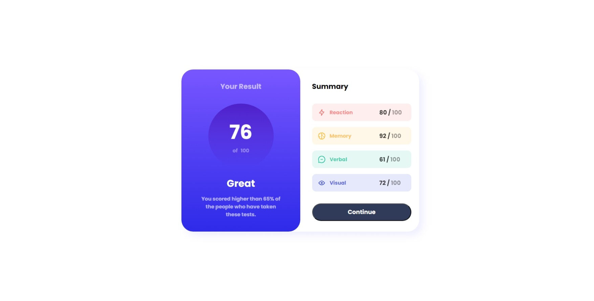
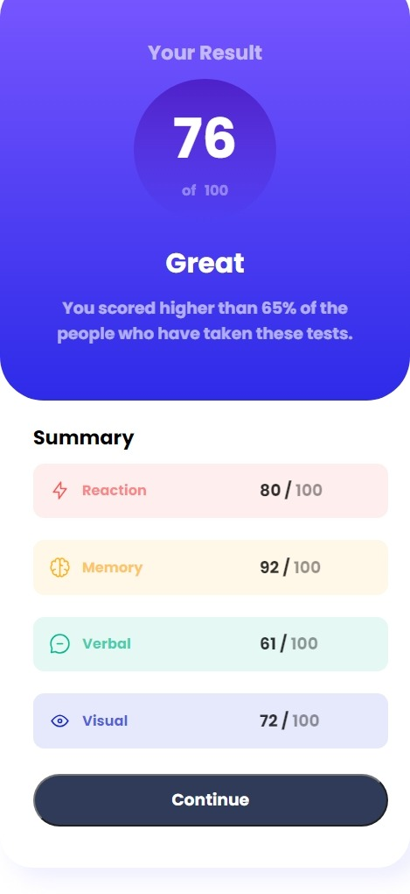

# Frontend Mentor - Results summary component solution

This is a solution to the [Results summary component challenge on Frontend Mentor](https://www.frontendmentor.io/challenges/results-summary-component-CE_K6s0maV). Frontend Mentor challenges help you improve your coding skills by building realistic projects. 

## Table of contents

- [Overview](#overview)
- [The challenge](#the-challenge)
- [Screenshot](#screenshot)
- [Solution Links](#links)
- [Built with](#built-with)
- [Continued development](#continued-development)
- [Useful resources](#useful-resources)
- [Author](#author)

## Overview

### The challenge

Users should be able to:

- View the optimal layout for the interface depending on their device's screen size
- See hover and focus states for all interactive elements on the page
- **Bonus**: Use the local JSON data to dynamically populate the content

### Screenshot
## screenshot for desktop models.

## screenshot for mobile design which has width of **375px**.

### Links

- Solution URL: [Add solution URL here]()
- Live Site URL: [https://uvarajand.github.io/Frontend-Mentor-Results-summary-component/](https://uvarajand.github.io/Frontend-Mentor-Results-summary-component/)

### Built with

- Semantic HTML5 markup
- CSS custom properties
- Flex in CSS
- Mobile-first workflow
- [Styled Components](https://styled-components.com/) - For styles

### Continued development

i would like to improve the mobile design,because it is little tricky.

### Useful resources

- [Flex](https://www.bing.com/search?pglt=169&q=flex+in+w3schools&cvid=16b987f512be41c2b6981d2f9f217fc3&aqs=edge.0.0j69i57j0l7.6395j0j1&FORM=ANAB01&PC=U531) - I really liked this pattern and will use it going forward.

## Author

- Website - [UVARAJAN D](https://uvarajand.github.io/uvarajan/)
- Frontend Mentor - [@UVARAJAND](https://www.frontendmentor.io/profile/UVARAJAND)

**Have fun building!** 🚀

